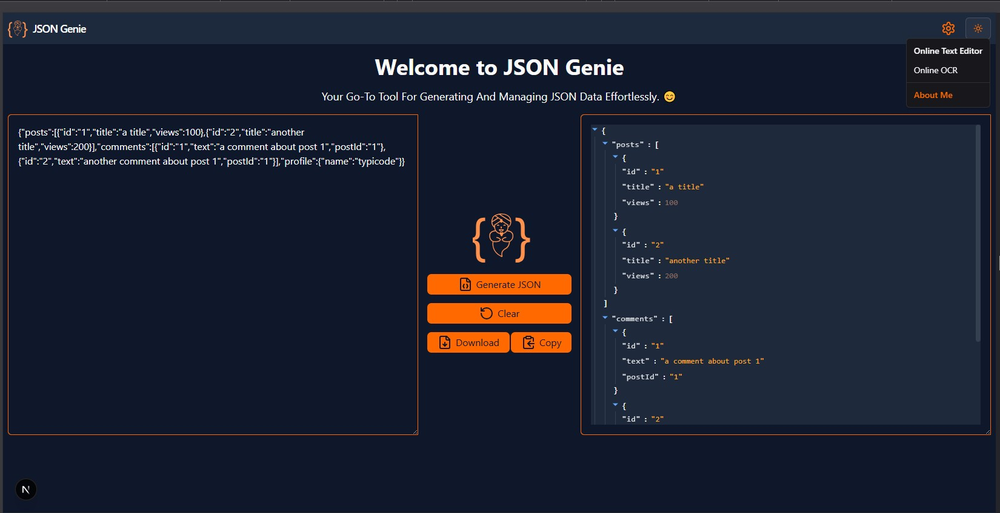

# JSON Genie

Effortlessly generate, view, and manage JSON data with a beautiful, modern interface.


## Features

- ✨ Live JSON Viewer with custom theming (light/dark mode)
- 📝 Editable input area for your JSON data
- 📥 Download JSON files
- ♻️ Clear and reset input with one click
- 🔄 Generate sample/test JSON
- ⚡ Responsive, user-friendly UI

## Getting Started

### Prerequisites
- [Node.js](https://nodejs.org/) (v18 or higher recommended)
- [pnpm](https://pnpm.io/) or [npm](https://www.npmjs.com/) or [yarn](https://yarnpkg.com/)

### Installation

1. Clone the repository:
   ```bash
   git clone https://github.com/imran9663/json-genie.git
   cd json-genie
   ```
2. Install dependencies:
   ```bash
   pnpm install
   # or
   npm install
   # or
   yarn install
   ```
3. Run the development server:
   ```bash
   pnpm dev
   # or
   npm run dev
   # or
   yarn dev
   ```
4. Open [http://localhost:3000](http://localhost:3000) in your browser.

## Usage

- Paste or type your JSON in the left textarea.
- Use the action buttons to generate, clear, or download JSON.
- View your JSON in a styled, interactive viewer on the right.
- Switch between light and dark themes using the theme toggle.

## Tech Stack
- [Next.js](https://nextjs.org/)
- [React](https://react.dev/)
- [react-json-view](https://github.com/mac-s-g/react-json-view)
- [Tailwind CSS](https://tailwindcss.com/)
- [Lucide Icons](https://lucide.dev/)

## Project Structure

```
src/
  app/
    page.js           # Main page component
    layout.js         # App layout
    globals.css       # Global styles
  components/
    Navbar.js         # Navigation bar
    PrimaryBtn.js     # Reusable button
    reactJsonTheme.js # Custom themes for JSON viewer
    ThemeSwitch.js    # Theme toggle
    ToastDestructive.js # Toast notifications
    ui/               # UI primitives
  utils/
    test.json         # Sample JSON data
```

## Customization
- Edit `src/components/reactJsonTheme.js` to adjust the JSON viewer's theme.
- Add new features or UI components in `src/components/`.

## License

MIT License. See [LICENSE](LICENSE) for details.

---

> Made with ❤️ by [Imran Pasha ] (https://imranpashai.netlify.app/)
